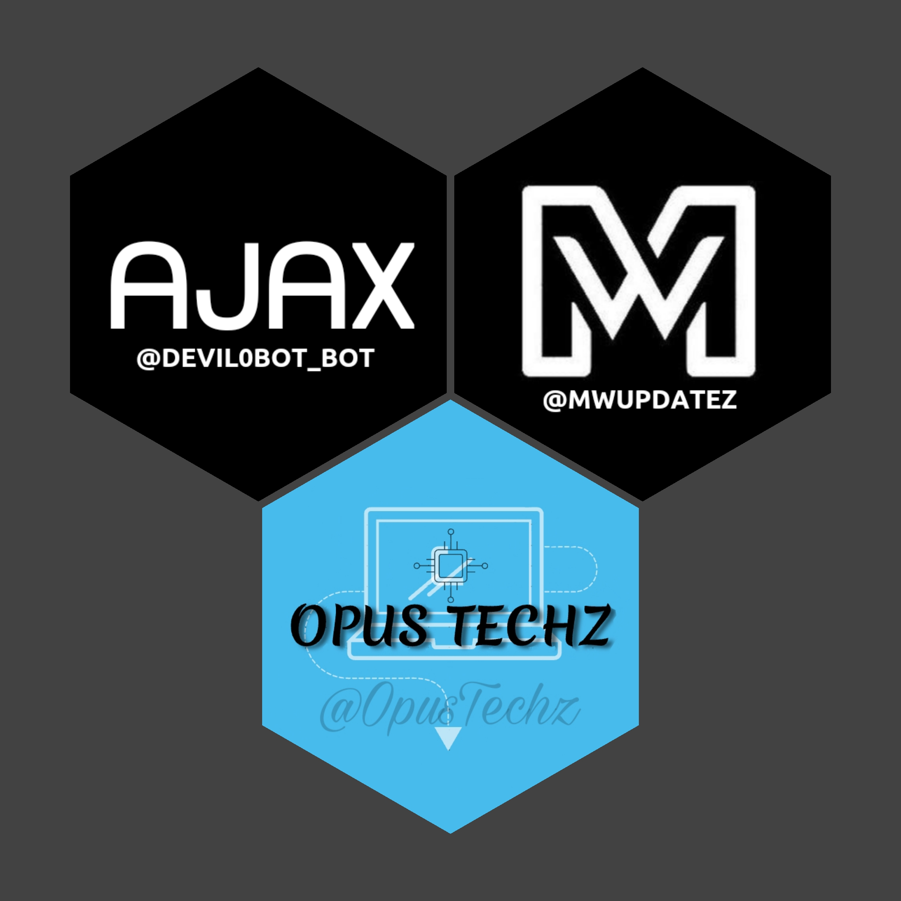

<p align="center">
  
</p>
<h1 align="center">
  <b>𝙰𝙹𝙰𝚇-𝙴𝚇𝚃𝚁𝙰-𝙵𝙴𝙰𝚃𝚄𝚁𝙴𝚂</b>
</h1>


## Features

- [x] Auto Filter
- [x] Manual Filter
- [x] IMDB
- [x] Admin Commands
- [x] Broadcast
- [x] Index
- [x] IMDB search
- [x] Inline Search
- [x] Random pics
- [x] ids and User info 
- [x] Stats, Users, Chats, Ban, Unban, Leave, Disable, Channel
- [x] Spelling Check Feature
- [x] Youtube Video , Song , Thumbnail Download.
- [x] Image Edit.
- [x] Google Translator.
- [x] Telegraph
- [x] Entertainment
- [x] Sticker ID Generator
- [x] COVID Information
- [x] File Store

## Variables

### Required Variables
* `BOT_TOKEN`: Create a bot using [@BotFather](https://telegram.dog/BotFather), and get the Telegram API token.
* `API_ID`: Get this value from [telegram.org](https://my.telegram.org/apps)
* `API_HASH`: Get this value from [telegram.org](https://my.telegram.org/apps)
* `CHANNELS`: Username or ID of channel or group. Separate multiple IDs by space
* `ADMINS`: Username or ID of Admin. Separate multiple Admins by space
* `DATABASE_URI`: [mongoDB](https://www.mongodb.com) URI. Get this value from [mongoDB](https://www.mongodb.com).
* `DATABASE_NAME`: Name of the database in [mongoDB](https://www.mongodb.com). For more help watch this 
* `LOG_CHANNEL` : A channel to log the activities of bot. Make sure bot is an admin in the channel.
### Optional Variables
* `PICS`: Telegraph links of images to show in start message.( Multiple images can be used seperated by space )


## Deploy
You can deploy this bot anywhere.


<details><summary>Deploy To Heroku</summary>
<p>
<br>
<a href="https://heroku.com/deploy?template=https://github.com/Aadhi000/Ajax-Extra-Features">
  
</a>
</p>
</details>

<details><summary>Deploy To VPS</summary>
<p>
<pre>
git clone https://github.com/Aadhi000/Ajax-V3
# Install Packages
pip3 install -r requirements.txt
Edit info.py with variables as given below then run bot
python3 bot.py
</pre>
</p>
</details>


## Commands
```
• /logs - to get the rescent errors
• /stats - to get status of files in db.
* /filter - add manual filters
* /filters - view filters
* /connect - connect to PM.
* /disconnect - disconnect from PM
* /del - delete a filter
* /delall - delete all filters
* /deleteall - delete all index(autofilter)
* /delete - delete a specific file from index.
* /info - get user info
* /id - get tg ids.
* /imdb - fetch info from imdb.
• /users - to get list of my users and ids.
• /chats - to get list of the my chats and ids 
• /index  - to add files from a channel
• /leave  - to leave from a chat.
• /disable  -  do disable a chat.
* /enable - re-enable chat.
• /ban  - to ban a user.
• /unban  - to unban a user.
• /channel - to get list of total connected channels
• /broadcast - to broadcast a message to all Eva Maria users
```

𝙳𝙴𝚅𝙴𝙻𝙾𝙿𝙴𝚁 ›› [𝐀𝐚𝐝𝐡𝐢](https://t.me/Aadhi011)                                                                                                                                        
𝙶𝚁𝙾𝚄𝙿 ›› [𝐌𝐨𝐯𝐢𝐞𝐬 𝐖𝐨𝐫𝐥𝐝](https://t.me/+EqhXLhL3T1w4Zjc1)                                             
𝙲𝙷𝙰𝙽𝙽𝙴𝙻 ›› [𝐋𝐚𝐭𝐞𝐬𝐭 𝐌𝐨𝐯𝐢𝐞𝐬 𝐇𝐮𝐛](https://t.me/+veUIdIW2CQ5mOGU5)
